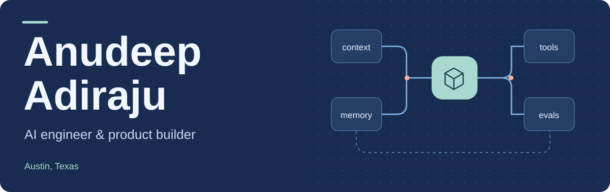
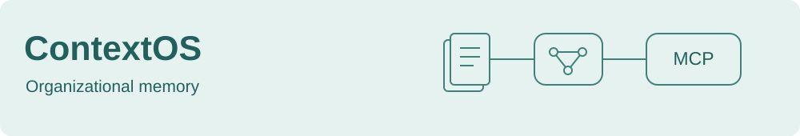
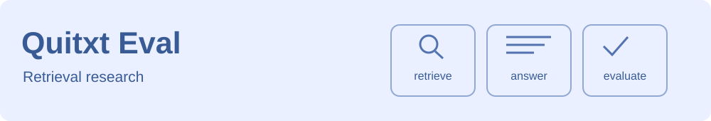

<picture>
  <source media="(max-width: 600px)" srcset="assets/profile/header-mobile.svg">
  
</picture>

I build retrieval systems, agent tools, and the applications around them. My work connects models to persistent data, useful interfaces, and evaluations you can inspect.

**[Visit my portfolio](https://www.anudeepadi.com/)** &nbsp; / &nbsp; **[Connect on LinkedIn](https://www.linkedin.com/in/adirajuadi/)**

### My toolkit

`Python` &nbsp; `TypeScript` &nbsp; `C++` &nbsp; `React` &nbsp; `FastAPI` &nbsp; `MCP`

## Selected work

<a href="https://github.com/anudeepadi/personal-brain-mcp">
  <picture>
    <source media="(max-width: 600px)" srcset="assets/profile/contextos-mobile.svg">
    
  </picture>
</a>

Document retrieval and conversation memory for AI assistants, exposed through MCP and FastAPI. Includes a runnable, provider-free walkthrough.

[Explore ContextOS](https://github.com/anudeepadi/personal-brain-mcp) &nbsp; / &nbsp; [Read the walkthrough](https://github.com/anudeepadi/personal-brain-mcp/blob/main/examples/offline_walkthrough.py)

<a href="https://github.com/anudeepadi/quit-txt-rag-eval">
  <picture>
    <source media="(max-width: 600px)" srcset="assets/profile/quitxt-mobile.svg">
    
  </picture>
</a>

Research code for evaluating retrieval, answer quality, and latency in smoking-cessation question answering. Try the synthetic example; study data is supplied separately.

[Explore Quitxt Eval](https://github.com/anudeepadi/quit-txt-rag-eval) &nbsp; / &nbsp; [See the synthetic example](https://github.com/anudeepadi/quit-txt-rag-eval/tree/master/examples)

<a href="https://github.com/anudeepadi/ugc-forge">
  <picture>
    <source media="(max-width: 600px)" srcset="assets/profile/ugc-mobile.svg">
    
  </picture>
</a>

A campaign-planning prototype that turns a brief into sample scripts and a review queue. Explore the workflow in the browser demo.

[Explore UGC Forge](https://github.com/anudeepadi/ugc-forge) &nbsp; / &nbsp; [Open the demo](https://ugc-forge-rose.vercel.app/)

### Also on my workbench

| Project | What you'll find |
| :--- | :--- |
| [Web Extract API](https://github.com/anudeepadi/web-extract-api) | Multi-engine web extraction with streaming progress. |
| [Delivery Workbench](https://github.com/anudeepadi/delivery-workbench) | Delivery planning, KPI calculators, risk tracking, and persistent drafts. |
| [LSTM from Scratch in C++](https://github.com/anudeepadi/lstm-from-scratch-cpp) | An educational recurrent network using the standard library. |

---

Interested in building something together? **[Let's connect.](https://www.linkedin.com/in/adirajuadi/)**
